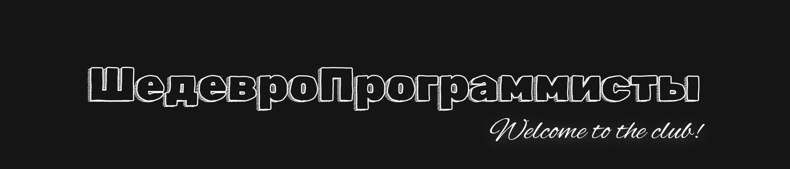

<h1>ШедевроПрограммисты</h1>

# 🙋‍♀️ Кто мы и наша цель
Мы, люди, которые уже большое количество времени потратили на программирование и IT. Мы учавствуем в хакатонах, олимпиадах и т.п., а также выкладываем наши работы и проекты сюда. Наша цель - помогать другим программистам нашими обучающими проектами. Публикуя наши проекты в открытый доступ, мы помогаем программистам уже в их проектах. Также нашими проектами здесь мы помогаем и себе в будущем.

# 👩‍💻 Наши технологии
## Языки программирования 

## Фреймворки и библиотеки

## Программы

# 🌈 Состав Шедевропрограммистов
- [Филипп (Delomoon)](https://github.com/delomoon)
- [Руслан (Neefko)](https://github.com/Neefko)
